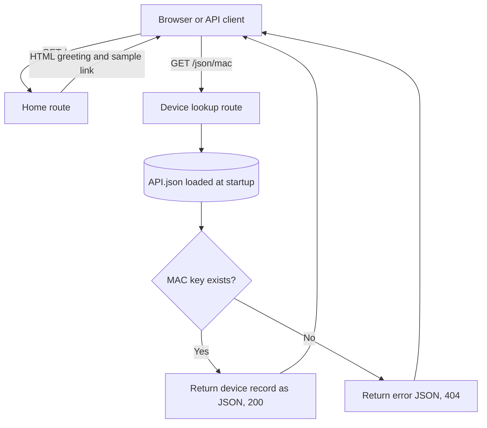

# Network Device API

A small Flask project for exploring network-device data stored as JSON. The current app reads device records from `API.json` and exposes a home page and a lookup endpoint. This README records the existing behavior and a starting plan for building the app further.

## Current Status

- Flask entry point: `app.py`
- Device data: `API.json`, indexed by MAC-like identifiers
- Dependencies: `req.txt` (includes Flask 3.1.3)
- Current Git branch: `main`
- Branches found during the repository scan: `main` only; no feature branches were present
- No Git remote was configured at the time this README was written
- There is no automated test suite yet

`app.py` also contains a `DISPOSITIVOS` dictionary, but no current route reads or returns it. Other root-level Python files are practice exercises and are not registered as Flask routes.

## Requirements

- Python 3
- pip

The repository does not currently declare a minimum Python version.

## Run Locally

From the project root in PowerShell:

```powershell
py -m venv .venv
.\.venv\Scripts\Activate.ps1
python -m pip install -r req.txt
python app.py
```

Open <http://127.0.0.1:5000/> in a browser. The app currently starts Flask with debug mode enabled; use that only for local development, not production.

Run commands from the project root because `app.py` opens `API.json` using a relative path when the module starts.

## Routes

The following routes are currently declared in `app.py`. Flask uses `GET` by default because no other HTTP methods are specified.

| Method | URL | Behavior | Response |
| --- | --- | --- | --- |
| `GET` | `/` | Returns a minimal HTML page with a greeting and a link to a sample device lookup. | HTML, `200 OK` |
| `GET` | `/json/<mac>` | Looks up `<mac>` as a top-level key in `API.json`. If found, prints selected fields to the server console and returns the complete device record as JSON. | JSON, `200 OK`; or `{"error":"Dispositivo no encontrado"}`, `404 Not Found` |

Example request for a key present in the current data file:

```text
GET http://127.0.0.1:5000/json/3D:RF:09:7F::
```

A key that is not present returns a JSON error with HTTP status `404`.

### Route Map



## Data Shape

`API.json` is an object keyed by device identifiers. A device record currently contains fields such as:

- `Name`: device name
- `Protocolos`: supported or configured network protocols
- `status`: device status
- `VLANs`: VLAN records, including `Ports`, `Policies`, `ET`, `IP`, and `SSH`

The exact keys and values may differ between devices. The app returns the stored record as-is and does not currently validate or normalize it.

## Repository Map

```text
.
|-- app.py                         # Flask app and current routes
|-- API.json                       # Device records used by the lookup route
|-- req.txt                        # Python dependencies
|-- Actividad.py                   # Interactive list/dictionary exercise
|-- # FUNCION QUE PERMITA INGRESAR ELEMENTOS.py
|-- a1.py                          # Small Python exercise
|-- c1.py, c2.py, c3.py, c4.py     # Python practice exercises
|-- e1.py                          # Device policy validation exercise
|-- README.md                      # Project and future-build reference
```

## Git Branch Plan

The repository currently has only the `main` branch. Keep `main` as the stable integration branch and create a short-lived branch per feature or focused change. Suggested branches for future work:

- `feature/device-inventory`: add an endpoint to list devices
- `feature/policy-validation`: integrate and test device policy checks
- `feature/web-interface`: replace the minimal HTML response with a usable interface
- `test/api-routes`: add route and data-loading tests
- `docs/project-plan`: expand the project documentation

These are proposed branch names, not branches that currently exist.

## Suggested Build Order

1. Add tests for the existing home and device lookup routes, including an unknown identifier.
2. Add a device inventory endpoint and define its response format.
3. Move device data loading and policy checks into small, testable modules.
4. Integrate the policy validation ideas in `e1.py` with the `API.json` data model.
5. Add input validation and consistent JSON error responses.
6. Build a web interface for browsing devices, VLANs, status, and policies.
7. Disable debug mode and add production configuration before deployment.

## Current Limitations

- All device data is loaded once at startup; editing `API.json` requires restarting the process.
- A missing or invalid `API.json` prevents the app from starting.
- The lookup route accepts any path value as a key and only distinguishes found from not found.
- The root page is inline HTML and has no device list.
- Policy examples and `DISPOSITIVOS` are not connected to the current routes.
- Debug mode is enabled in the current `app.py` entry point.
