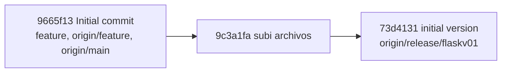

# Flassk

Reference for the current Flask application and a starting point for future development.

## Current State

- Flask entry point: `app.py`
- The app declares two routes: `/` and `/json/<mac>`.
- The lookup route reads a top-level device mapping from `API.json` when `app.py` is imported.
- `API.json` is not present in the current `feature` checkout, so the app cannot currently start. Add the data file before running it.
- The `DISPOSITIVOS` dictionary in `app.py` is currently not used by either route.
- No dependency manifest or automated tests are present in this checkout.

## Run Locally

From the project root, after adding a valid `API.json`:

```bash
python -m pip install Flask
python app.py
```

The development server uses Flask's default address, `http://127.0.0.1:5000/`, and debug mode is enabled. Run from the project root because the app opens `API.json` by a relative path. Do not use the debug server in production.

## Routes

Flask registers `GET`, `HEAD`, and `OPTIONS` for both routes by default. The usual browser/API requests are `GET`.

| Method | URL | Behavior | Response |
| --- | --- | --- | --- |
| `GET` | `http://127.0.0.1:5000/` | Returns a small HTML page with the heading "Hola mundo" and a link to the sample device lookup. | HTML, `200 OK` |
| `GET` | `http://127.0.0.1:5000/json/<mac>` | Uses `<mac>` as a top-level key in the mapping loaded from `API.json`. If found, prints `Name`, `Protocolos`, `status`, and `VLANs` to the server console, then returns the complete record. | JSON, `200 OK`; if missing, `{"error":"Dispositivo no encontrado"}`, `404 Not Found` |

Example lookup URL used by the home page:

```text
http://127.0.0.1:5000/json/3D:RF:09:7F::
```

The lookup expects each matching record to contain the four fields it prints. A missing field currently raises an error rather than returning a structured API error. The endpoint returns the record without validation or normalization.

### Route Map


## Data Expectations

`API.json` must contain a JSON object whose keys are device identifiers (the `mac` route parameter) and whose values are device records. Every requested record needs `Name`, `Protocolos`, `status`, and `VLANs`, because the route reads these fields before returning the record. The current checkout does not include an example data file.

## Repository Branches

Branch information observed during this scan:

| Branch | Location | State |
| --- | --- | --- |
| `feature` | Local branch, tracking `origin/feature` | Current checkout at `9665f13` (`Initial commit`) |
| `main` | `origin/main` and `origin/HEAD` | At the same `9665f13` commit; no local `main` branch is present |
| `release/flaskv01` | `origin/release/flaskv01` | Two commits ahead of `9665f13`; contains additional project files |

The scanned commit history is linear:



Keep `main` as the stable integration branch. Use short-lived `feature/*` branches for implementation and `test/*` branches for isolated test work. The branch names below are proposals, not branches confirmed to exist:

- `feature/device-inventory`: add a route to list devices.
- `feature/policy-validation`: connect the existing device policy examples to the API.
- `feature/web-interface`: replace the minimal home page with a device browser.
- `test/api-routes`: add coverage for success, missing devices, and malformed records.

## Suggested Next Steps

1. Restore or add `API.json` and define a small, documented example record.
2. Add a dependency manifest and tests for both existing routes.
3. Handle missing data files and incomplete records with clear errors.
4. Decide whether `DISPOSITIVOS` is intended to be an API data source or remove the unused duplicate data.
5. Add inventory and policy features behind explicitly documented routes.
6. Disable debug mode and configure a production WSGI server before deployment.